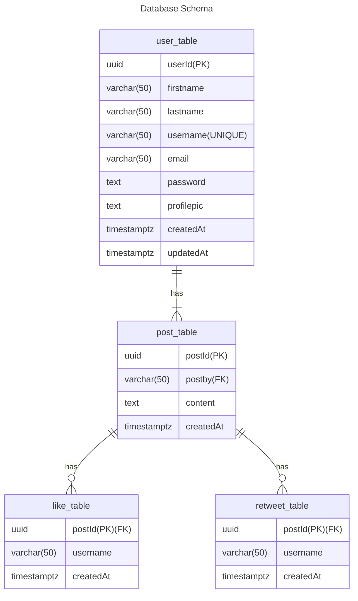

# Twiker_backend
Using .NET 8 + ASP NET Core 8 as execution environments to make twitter-like projects for practice purposes

### Database Schema

```mermaid
---
title: Database Schema
---

erDiagram
    user_table ||--|{ post_table: has
    user_table {
        uuid userId(PK)
        varchar(50) firstname
        varchar(50) lastname
        varchar(50) username(UNIQUE)
        varchar(50) email
        text password
        text profilepic
        timestamptz createdAt
        timestamptz updatedAt
    }

    post_table ||--o{ like_table: has
    post_table ||--o{ retweet_table: has
    post_table {
        uuid postId(PK)
        varchar(50) postby(FK)
        text content
        timestamptz createdAt
    }

    like_table {
        uuid postId(PK)(FK)
        varchar(50) username
        timestamptz createdAt
    }

    retweet_table {
        uuid postId(PK)(FK)
        varchar(50) username
        timestamptz createdAt
    }
```
